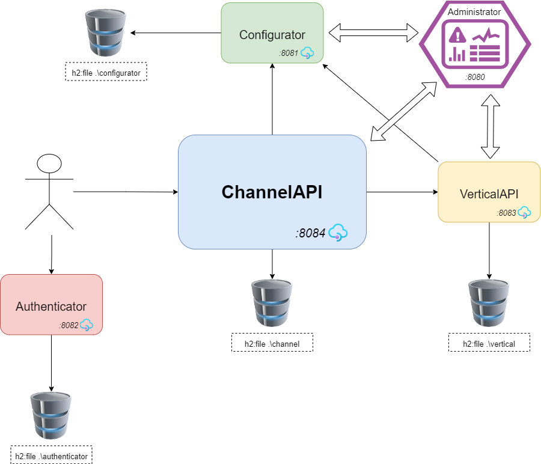

Uni42: a SpringBoot REST APIs
===================================

# What is `Uni42`?
Uni42 is a SpringBoot tutorial project of a RestAPIs and their interactions.

## System Description

1. **Administrator**: Spring Boot Admin Console, to see and monitor all APIs.
2. **Configurator**: RestAPI to manage (create, retrieve, update and delete records) custom configuration attributes that can be changed in realtime.
3. **Authenticator**: RestAPI service to perform authentication in order to generate a JWToken that will be spent to call ChannelAPI.
4. **VerticalAPI**: RestAPI service that provides Customer service and C.R.U.D. operation to manage customer and its data.
5. **ChannelAPI**: RestAPI invoked by final user, to retrieve Customer information and last access.

# How to run?
The project is implemented using maven and SpringBoot, so to run software is really easy.  
Into the project root directory is enough execute following shell commands:

```shell
#-- to run Administrator
cd Administrator
chmod +x mvnw
./mvnw spring-boot:run
```

```shell
#-- to run Authenticator
cd ..
cd Authenticator
chmod +x mvnw
./mvnw spring-boot:run
```

```shell
#-- to run Configurator
cd ..
cd Configurator
chmod +x mvnw
./mvnw spring-boot:run
```

```shell
#-- to run VerticalAPI
cd ..
cd VerticalAPI
chmod +x mvnw
./mvnw spring-boot:run
```

```shell
#-- to run ChannelAPI
cd ..
cd ChannelAPI
chmod +x mvnw
./mvnw spring-boot:run
```
Admin console will be available on [localhost:8080](http://localhost:8080),  
where you can see metrics to monitor services and the list of APIs Swagger entry points.

Obviously we suggest to use an IDE (e.g. [IntelliJ](https://www.jetbrains.com/idea/)) that supports SpringBoot to simplify the startup procedures.
# Why 42?


###### If you are asking why the 42, the secret is in the name, but remember: <br/> The Answer is certainly correct, but probably, the question will not.